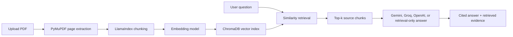

# RAGistant: RAG Based Research Paper Assistant

RAGistant is a Streamlit app by **Shlok Goud** for asking questions over uploaded research papers. It uses Retrieval-Augmented Generation to extract PDF text, split it into searchable chunks, retrieve the most relevant evidence, and answer with page-level source references.

The app is designed as a practical research assistant and portfolio project: lightweight enough to run locally, but complete enough to show document loading, chunking, embeddings, vector search, answer generation, citation handling, and evidence inspection.

## Architecture



## How RAG Works In This App

1. **Load**: Uploaded PDFs are read with PyMuPDF. Each text-bearing page keeps file and page metadata.
2. **Chunk**: LlamaIndex splits text into overlapping chunks so retrieval can find focused evidence.
3. **Embed**: The app creates vectors with local Hugging Face embeddings or OpenAI embeddings.
4. **Index**: ChromaDB stores the chunk vectors in a local `.chroma/` database.
5. **Retrieve**: A user question is matched against the vector store using top-k similarity search.
6. **Generate**: Gemini, Groq, or OpenAI can generate a source-grounded answer from the retrieved chunks.
7. **Inspect**: The app shows citations, similarity scores, and an expandable retrieved-chunk evidence panel.

## Features

- Upload one or more research PDFs.
- Extract page-level text and source metadata.
- Configure chunk size, chunk overlap, and number of retrieved chunks.
- Store embeddings in ChromaDB.
- Use local Hugging Face embeddings to avoid embedding API costs.
- Generate answers with Google Gemini, Groq, OpenAI, or retrieval-only mode.
- Keep API keys out of the UI; keys are loaded from `.env`.
- Use sample question chips for faster paper exploration.
- View an About page with the RAG pipeline and developer information.

## Tech Stack

- Python
- Streamlit
- LlamaIndex
- ChromaDB
- PyMuPDF
- Hugging Face sentence-transformer embeddings
- OpenAI embeddings, optional
- Google Gemini, Groq, OpenAI, or retrieval-only answer mode

## Setup

```bash
python -m venv .venv
.venv\Scripts\activate
pip install -r requirements.txt
copy .env.example .env
```

Add keys to `.env` only for the providers you want to use. API keys are loaded from your local environment and are not editable or displayed in the Streamlit UI.

For the recommended low/no-cost setup:

```bash
GEMINI_API_KEY=your_gemini_api_key_here
GROQ_API_KEY=your_groq_api_key_here
```

Use OpenAI only if you want OpenAI generation or OpenAI embeddings:

```bash
OPENAI_API_KEY=your_openai_api_key_here
```

Run the app:

```bash
streamlit run app.py
```

## Recommended Configuration

For most local demos:

- **Embedding provider:** Local Hugging Face
- **Answer provider:** Google Gemini or Groq
- **Fallback:** Retrieval only
- **Chunk size:** 768-1024
- **Chunk overlap:** 120-200
- **Retrieved chunks:** 6-8 for broad questions, 4-6 for specific questions

This avoids OpenAI quota issues for embeddings and keeps answer generation provider-agnostic.

## Sample Questions

- What did the authors find in living daddy-longlegs?
- How do vestigial eyes affect fossil placement?
- What evidence supports the main finding?
- What are the limitations or future directions?
- What dataset, method, or experiment did the authors use?

## Limitations

- Scanned PDFs need OCR before this app can extract useful text.
- Complex tables, equations, and multi-column layouts may need specialized parsing.
- Retrieval quality depends on chunk size, overlap, and the wording of the question.
- Generated answers should be checked against the retrieved chunks.
- The local vector index is intended for portfolio/demo use, not multi-user production workloads.

## Future Improvements

- Add OCR support for scanned papers.
- Add table extraction and structured table citations.
- Add reranking to improve retrieval quality.
- Add PDF preview with citation highlighting.
- Add export to Markdown or PDF for research notes.
- Add evaluation tests for retrieval precision and citation faithfulness.

## Project Structure

```text
.
├── app.py
├── requirements.txt
├── .env.example
├── .streamlit/
│   └── config.toml
└── pages/
    └── About.py
```
