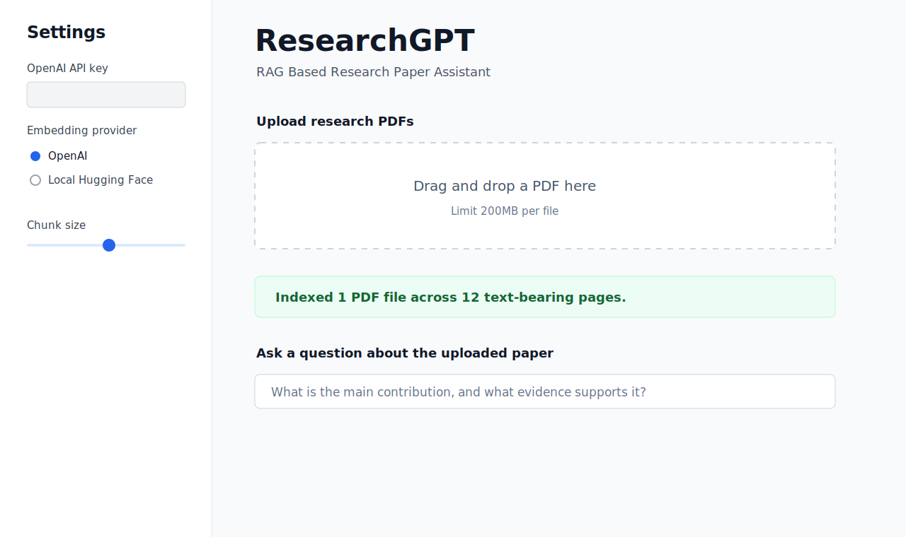
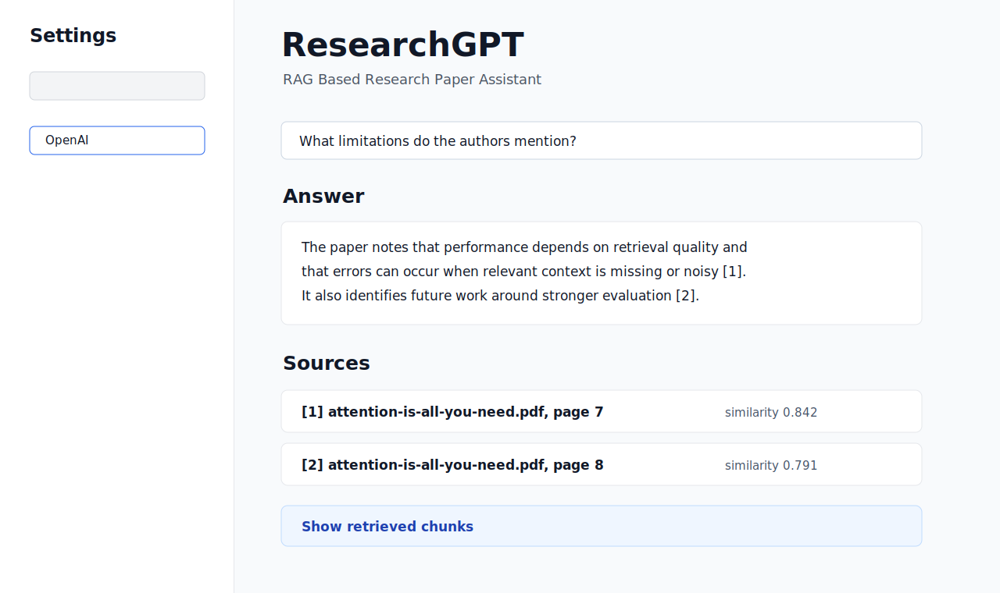
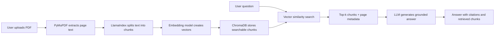

# ResearchGPT: RAG Based Research Paper Assistant

ResearchGPT is a Streamlit app that lets users upload research papers, ask questions, and receive document-grounded answers with page-level source references. It demonstrates a complete Retrieval-Augmented Generation workflow: PDF loading, page extraction, chunking, embeddings, vector search, answer generation, and source inspection.

## Demo Screenshots





## Architecture



## How RAG Works In This App

1. **Load**: Uploaded PDFs are read with PyMuPDF, and each text-bearing page becomes a LlamaIndex `Document` with file and page metadata.
2. **Chunk**: LlamaIndex `SentenceSplitter` breaks page text into overlapping chunks so retrieval has focused evidence.
3. **Embed**: The app creates vectors with OpenAI embeddings or a local Hugging Face sentence-transformer model.
4. **Index**: ChromaDB stores the chunk vectors in a persistent local collection under `.chroma/`.
5. **Retrieve**: A user question is embedded and matched against the vector store using top-k similarity search.
6. **Generate**: If an OpenAI API key is configured, the selected chunks are passed to an LLM with instructions to cite the retrieved evidence.
7. **Inspect**: The app shows source labels and an expandable view of the retrieved chunks so users can audit the answer.

## Core Features

- Upload one or more research PDFs.
- Extract page text with source metadata.
- Split papers into configurable overlapping chunks.
- Store embeddings in ChromaDB.
- Use OpenAI or local Hugging Face embeddings.
- Ask natural-language questions about the paper.
- Return an answer with source references.
- Show retrieved chunks in an expandable evidence panel.

## Tech Stack

- Python
- Streamlit
- LlamaIndex
- ChromaDB
- OpenAI embeddings or Hugging Face embeddings
- PyMuPDF

## Setup

```bash
python -m venv .venv
.venv\Scripts\activate
pip install -r requirements.txt
copy .env.example .env
```

Add your OpenAI API key to `.env` if you want generated answers:

```bash
OPENAI_API_KEY=your_openai_api_key_here
```

Then run:

```bash
streamlit run app.py
```

The app can also run in retrieval-only mode with local Hugging Face embeddings. Select **Local Hugging Face** in the sidebar. The first run may download the embedding model.

## Sample Questions And Answers

**Question:** What is the main contribution of this paper?

**Answer:** The answer should summarize the contribution using only retrieved paper passages and cite the relevant pages, for example `[1]` and `[2]`.

**Question:** What dataset or evaluation method did the authors use?

**Answer:** ResearchGPT should identify the dataset, benchmark, metric, or study design mentioned in the paper and cite the retrieved source pages.

**Question:** What limitations do the authors mention?

**Answer:** The app should extract limitations from the discussion, conclusion, or limitations sections and show the exact chunks used as evidence.

## Limitations

- Scanned PDFs need OCR before this app can extract useful text.
- Tables, equations, and multi-column layouts may need domain-specific parsing for best results.
- The local vector index is intended for personal or demo use, not multi-user production workloads.
- Generated answers are only as reliable as the retrieved chunks and the model prompt.
- Very large papers or many simultaneous uploads can require more memory and processing time.

## Future Improvements

- Add OCR support for scanned papers.
- Add table extraction and structured table citations.
- Support persistent project workspaces per user.
- Add citation highlighting inside a PDF preview.
- Add reranking for better retrieval quality.
- Add export to Markdown or PDF for research notes.
- Add evaluation tests for retrieval precision and citation faithfulness.

## Project Structure

```text
.
├── app.py
├── requirements.txt
├── .env.example
├── .streamlit/
│   └── config.toml
└── docs/
    └── screenshots/
        ├── 01-upload-and-index.svg
        └── 02-answer-with-citations.svg
```
